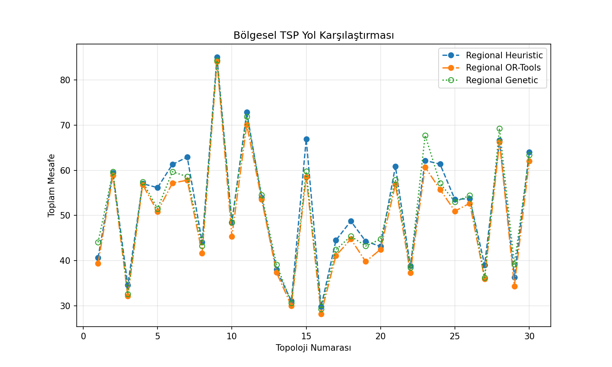
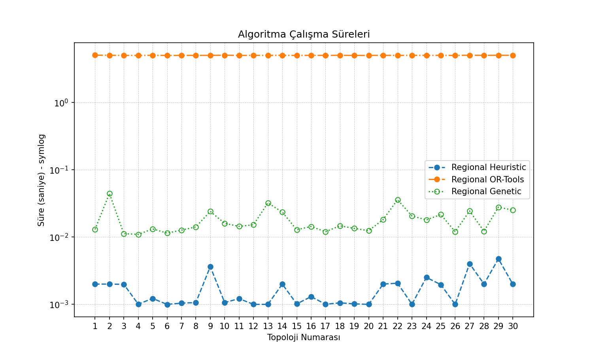
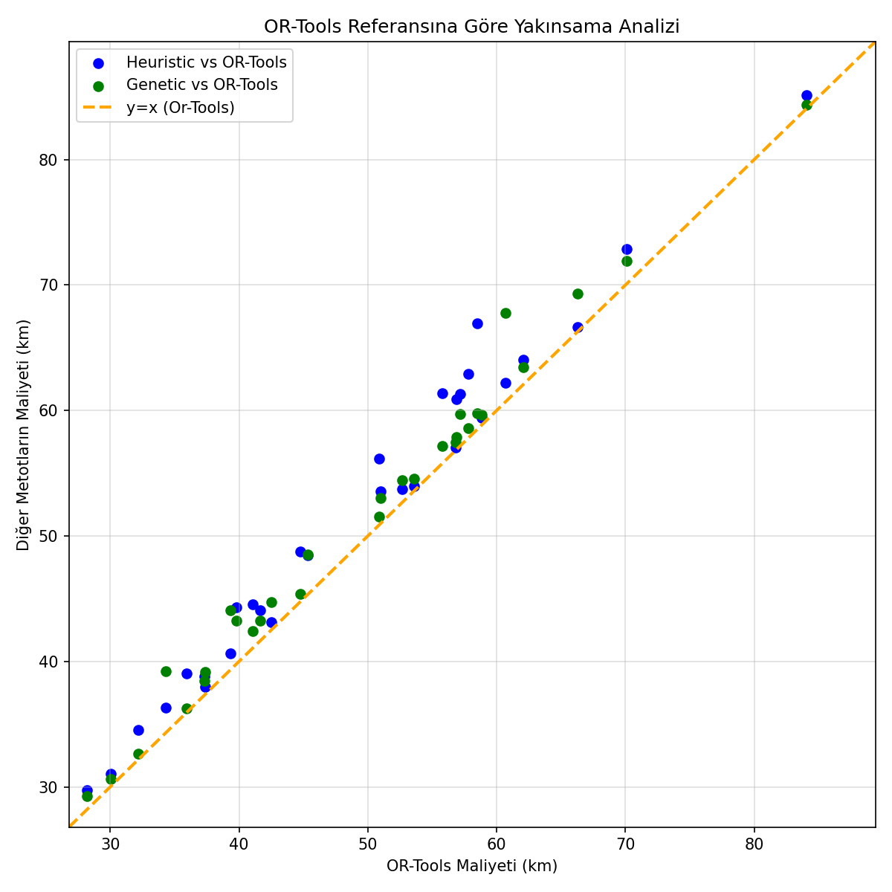

# 🌍 Bölgesel Gezgin Satıcı Problemi (Regional TSP / TSP with Neighborhoods)

Bu proje, **Bursa Nilüfer** ilçesinin gerçek sokak ağı üzerinde tanımlanan **Bölgesel Gezgin Satıcı Problemi**'ni (*Traveling Salesperson Problem with Neighborhoods - TSPN*) çözmek ve üç farklı optimizasyon yaklaşımının performansını (toplam mesafe ve hesaplama süresi) karşılaştırmak amacıyla geliştirilmiştir.

Klasik Gezgin Satıcı Problemi'nden (TSP) farklı olarak, ziyaret edilecek her hedef sabit tek bir nokta yerine, belirlenen bir yarıçap (`search_radius = 200m`) içindeki komşu düğümler kümesinden (*bölge*) oluşur. Algoritmaların amacı, her bölgeden en az bir düğümü kapsayarak turu minimum toplam mesafe ile tamamlamaktır.

---

## 📌 İçindekiler
- [Kullanılan Yöntemler ve Algoritmalar](#-kullanılan-yöntemler-ve-algoritmalar)
- [Görsel Analiz ve Performans Karşılaştırmaları](#-görsel-analiz-ve-performans-karşılaştırmaları)
- [Proje Mimarisi ve Dosya Yapısı](#-proje-mimarisi-ve-dosya-yapısı)
- [Özet Bulgular](#-özet-bulgular)

---

## 🧠 Kullanılan Yöntemler ve Algoritmalar

Problem 3 farklı yaklaşım ile ele alınmış ve karşılaştırılmıştır:

1. **Açgözlü Araya Ekleme Sezgiseli (`Heuristic - Greedy Insertion`)**:
   - Başlangıçta en yakın komşulukla başlar ve kalan bölgeleri turu minimum uzatacak pozisyonlara ardışık olarak ekler.
   - Son derece hızlıdır ancak yerel minimumlara takılabilmektedir.
2. **Google OR-Tools (`Constraint Programming / Routing Engine`)**:
   - Endüstriyel seviyedeki optimizasyon kütüphanesi ile modellenmiştir.
   - Küresel optimuma en yakın ve en kaliteli rotaları üretir.
3. **Genetik Algoritma (`Genetic Algorithm - GA`)**:
   - Popülasyon tabanlı evrimsel optimizasyon yaklaşımı (çaprazlama, mutasyon, elitizm).
   - Hem bölge ziyaret sıralamasını hem de ilgili bölge içindeki en uygun düğüm seçimini optimize eder.

---

## 📊 Görsel Analiz ve Performans Karşılaştırmaları

30 farklı rastgele topoloji üzerinde yürütülen deneylerin sonuçları:

### 1. Rota Mesafesi Karşılaştırması (km)
Tüm topolojiler boyunca elde edilen toplam tur mesafeleri:
<p align="center">
  
</p>

### 2. Çalışma Süreleri (Logaritmik Ölçek)
Algoritmaların çalışma sürelerinin saniye cinsinden karşılaştırması (Symlog ölçeği):
<p align="center">
  
</p>

> **Not:** Heuristic ve Genetik algoritmalar milisaniye mertebesinde (0.001s - 0.04s) sonuca ulaşırken; OR-Tools yüksek doğruluk ve optimum arama derinliği nedeniyle ~5 saniye civarında sabitlenmiştir.

### 3. OR-Tools Referansına Göre Yakınsama Analizi
Yöntemlerin OR-Tools optimal referans hattına ($y = x$) göre maliyet sapmaları:
<p align="center">
  
</p>

---

## 📁 Proje Mimarisi ve Dosya Yapısı

```plaintext
Regional-TPS/
│
├── main.py                        # Ana orkestrasyon, deney döngüsü ve veri akışı
├── ortools_metot.py               # Google OR-Tools rota optimizasyonu implementasyonu
├── greedy_intertion.py            # Açgözlü Araya Ekleme (Greedy Insertion) algoritması
├── genetic.py                     # Genetik Algoritma implementasyonu
├── folium_map.py                  # OpenStreetMap & Folium tabanlı interaktif harita motoru
├── comparison_graphs.py           # Matplotlib ile görsel grafik üretim scripti
├── bursa_nilufer_static.graphml   # OSMnx üzerinden önbelleklenen yol ağı grafı
│
└── outputs/                       # Tüm deney çıktıları
    ├── maps/                      # Üretilen interaktif Folium haritaları (.html)
    ├── regional_tsp_results.csv   # 30 topolojiye ait mesafe ve süre ölçüm verileri
    ├── Bolgesel_TPS_Karsilastirma.pdf # Projenin detaylı raporu
    ├── karsilastirma_mesafe.png   # Algoritma mesafe karşılaştırma grafiği
    ├── karsilastirma_zaman.png    # Algoritma çalışma süresi grafiği
    └── karsilastirma_dagilim.png  # Referans yakınsama saçılım grafiği
```

---

## 📈 Özet Bulgular

- **En Düşük Rota Maliyeti**: **OR-Tools**, hemen hemen tüm topolojilerde en kısa toplam mesafeyi elde ederek en başarılı yöntem olmuştur.
- **En Hızlı Yöntem**: **Greedy Insertion**, ortalama `~0.001 - 0.002 saniye` ile neredeyse anlık çalışmakta olup iyi bir başlangıç çözümü sunmaktadır.
- **Denge Noktası (Genetik Algoritma)**: Genetik Algoritma, çalışma süresi açısından (`~0.01 - 0.04 saniye`) son derece hızlı kalırken rota kalitesinde OR-Tools'a çok yakın sonuçlar elde etmiştir.

---

> 📌 **Proje Geçmişi:**  
> *Bu çalışma, dersi kapsamında **GitHub Classroom** üzerinde geliştirdiğim dönem ödevimdir. Çalışmayı kişisel portfolyomda derli toplu sergilemek amacıyla kendi hesabıma aktardım; bu nedenle önceki commit geçmişi Classroom reposunda kalmıştır.*
